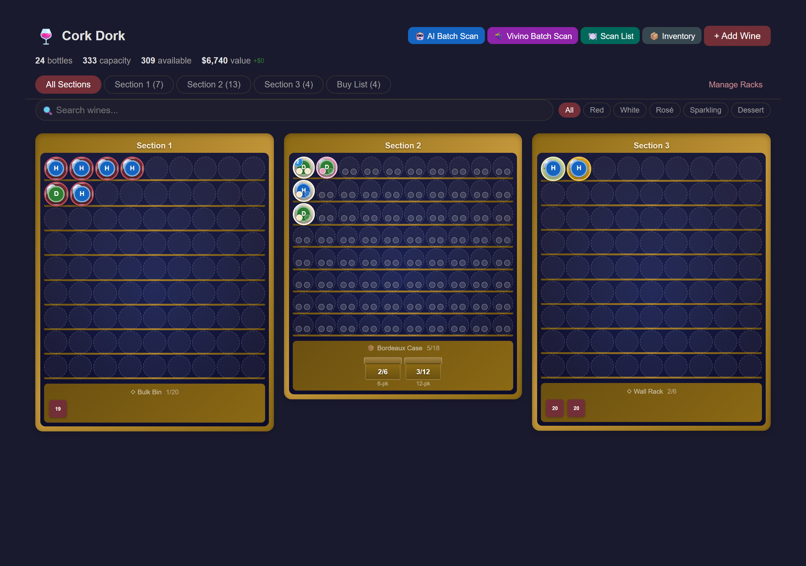
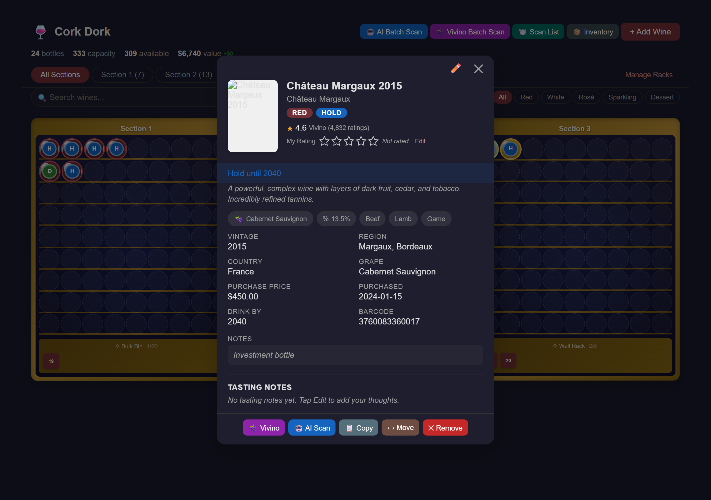

# Wine Cellar Tracker for Home Assistant

A custom Home Assistant integration for managing your wine collection. Track bottles by location, scan labels with AI, get Vivino ratings and pricing, drag-and-drop bottles between slots, and visualize your cellar with an interactive Lovelace card.

[](https://github.com/hacs/integration)





## Features

### Visual Cellar Management
- **Interactive Cabinet Grid** — Color-coded bottles by type (red, white, rosé, sparkling, dessert) with thumbnail images, disposition badges (Drink/Hold/Past Peak), and Vivino ratings
- **Drag & Drop** — Rearrange bottles by dragging on desktop; long-press to move on mobile
- **Move & Swap** — Move button in wine detail or long-press on mobile; bottles swap automatically if the target cell is occupied
- **Copy & Paste** — Duplicate wines across your cellar for multi-bottle purchases
- **Flexible Storage Zones** — Convert any rack row into a named storage zone (e.g., "Box Storage", "Pending") via rack settings
- **Search & Filter** — Filter by wine type or search by name, winery, region, or grape variety
- **Statistics Dashboard** — Total bottles, capacity, available slots, and total cellar value at a glance
- **Responsive Design** — Optimized layouts for phone, tablet, and desktop with dark mode support

### AI-Powered Wine Intelligence
- **One-Scan Label Recognition** — Snap a photo of a wine label and Google Gemini identifies the wine and provides a full sommelier assessment in one call: name, winery, vintage, type, region, grape variety, disposition, drink window, tasting description, estimated price, and critic rating estimates (Wine Spectator, Robert Parker, James Dunnuck, Antonio Galloni)
- **AI Batch Scan** — One-click full AI analysis on your entire cellar: disposition, drink windows, descriptions, pricing, and ratings for every bottle
- **Restaurant Wine List Scanner** — Photograph a restaurant wine list and instantly see Vivino ratings, critic scores, market prices, and markup percentages for every wine on the menu. Highlights best-value picks and lets you add any wine to your cellar with one tap.
- **Auto-Enrich on Add** — When you add a wine, Vivino data (rating, price, description, food pairings) is automatically fetched in the background

### Vivino Integration
- **Vivino Batch Scan** — Refresh all wines from Vivino in one click: ratings, review counts, market pricing, descriptions, food pairings, alcohol content, and grape variety
- **Individual Vivino Refresh** — Update any single wine's Vivino data from the detail dialog
- **Wine Search** — Search Vivino by name to find and add wines without a barcode

### Scanning & Input
- **Camera Barcode Scanning** — Point your phone or tablet camera at a barcode to auto-lookup details from Vivino and Open Food Facts
- **AI Label Scanning** — Photo-based label recognition with full wine analysis
- **Manual Entry** — Add wines by hand with a comprehensive form

### Ratings & Notes
- **Interactive Half-Star Rating** — Rate wines from 0.5 to 5.0 stars
- **Structured Tasting Notes** — Record aroma, taste, finish, and overall impression
- **AI Critic Estimates** — Gemini provides estimated scores from Wine Spectator, Robert Parker, James Dunnuck, and Antonio Galloni
- **Vivino Community Ratings** — Real ratings and review counts from Vivino's user base

### Home Assistant Integration
- **HA Sensors** — Entities for total bottles, capacity percentage, and per-cabinet counts for use in automations and dashboards
- **Services** — Automate adding, removing, and moving wines via HA services

## Installation

### HACS (Recommended)

1. Open HACS in your Home Assistant instance
2. Click the three dots in the top right and select **Custom repositories**
3. Add `https://github.com/BaconWappedBitcoin/ha-wine-cellar` with category **Integration**
4. Click **Install**
5. Restart Home Assistant

### Manual

1. Copy the `custom_components/wine_cellar` folder into your Home Assistant `custom_components` directory
2. Restart Home Assistant

## Setup

1. Go to **Settings > Devices & Services > Add Integration**
2. Search for **Wine Cellar** and follow the setup flow
3. Add the Lovelace card to your dashboard:

```yaml
type: custom:wine-cellar-card
title: Wine Cellar
```

### AI Features (Optional)

To enable label recognition, AI analysis, and batch AI scanning:

1. Get a free API key from [Google AI Studio](https://aistudio.google.com/apikey)
2. Go to **Settings > Devices & Services > Wine Cellar > Configure**
3. Enter your Gemini API key
4. Features unlocked:
   - **Recognize Label** button in the Add Wine dialog (camera → full analysis in one scan)
   - **AI** button on individual wines (full analysis with disposition, ratings, pricing)
   - **AI Batch** button in the card header (analyze all wines at once)

## Default Cabinet Layout

The integration ships with 3 cabinet sections, each with 10 rows and 9 columns (90 slots per section, 270 total). The bottom row of each section defaults to a "Box Storage" zone. Cabinet dimensions, names, and storage zone rows can be customized through the rack settings dialog (gear icon).

## Data Sources

| Source | Data Provided |
|---|---|
| **Vivino** | Wine name, winery, region, country, type, vintage, rating, ratings count, image, grape variety, description, food pairings, alcohol %, market price |
| **Open Food Facts** | Wine name, brand, origin, country, image |
| **UPC Item DB** | Wine name, brand (barcode lookup) |
| **Google Gemini** | Label recognition, full wine analysis (disposition, drink window, description, estimated price, critic rating estimates) |

## Services

| Service | Description |
|---|---|
| `wine_cellar.add_wine` | Add a wine bottle to your collection |
| `wine_cellar.remove_wine` | Remove a wine bottle |
| `wine_cellar.move_wine` | Move a wine to a different cabinet/position |
| `wine_cellar.scan_barcode` | Look up a barcode and fire a result event |

## Sensors

| Entity | Description |
|---|---|
| `sensor.wine_cellar_total_bottles` | Total number of bottles in your cellar |
| `sensor.wine_cellar_capacity` | Percentage of cellar capacity used |
| `sensor.wine_cellar_cabinet_*_count` | Bottle count per cabinet section |

## License

MIT
